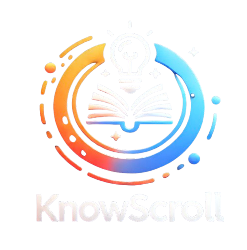
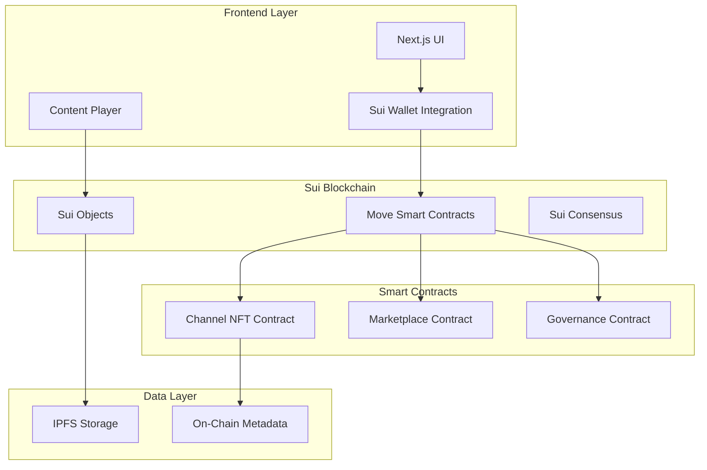
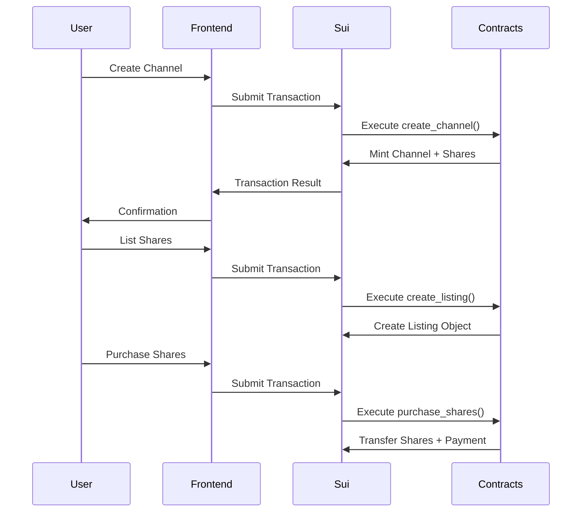

# KnowScroll - Sui Edition 🧠⚡

<div align="center">
  

  <h3>Transform Mindless Scrolling into Meaningful Learning on Sui Blockchain</h3>

  <p>
    <a href="#features">Features</a> •
    <a href="#architecture">Architecture</a> •
    <a href="#installation">Installation</a> •
    <a href="#usage">Usage</a> •
    <a href="#smart-contracts">Smart Contracts</a> •
    <a href="#deployment">Deployment</a> •
    <a href="#contributing">Contributing</a>
  </p>

  <p><em>Built for Sui Blockchain - Leveraging Move Smart Contracts</em></p>
</div>

---

## 🌟 Overview

**KnowScroll** is a revolutionary educational platform that transforms the endless scroll of social media into a productive, enriching learning experience. Built on the Sui blockchain, it combines the addictive nature of short-form content with meaningful educational value, powered by fractional NFT ownership and decentralized governance.

### 💡 The Problem We Solve

- **Time Wasted**: Average person spends 40-45 minutes daily on social media with minimal value
- **Guilt & FOMO**: Endless scrolling creates post-browsing guilt and empty feelings
- **Centralized Control**: Traditional platforms give users no stake in content they consume
- **Low Educational Value**: Most social content lacks structured learning progression

### 🚀 Our Solution

KnowScroll maintains social media's engaging qualities while ensuring every moment adds value:

- **📚 Educational Micro-Content**: AI-generated, expert-curated educational content in engaging format
- **🎯 Structured Learning Paths**: Topics follow logical sequences with thematic organization
- **🔗 Decentralized Ownership**: Purchase fractional shares in channels, earn revenue, govern content
- **🎮 Token-Based Incentives**: Earn rewards for learning engagement and content interaction
- **⚡ Sui-Powered Performance**: Lightning-fast transactions with sub-second finality

---

## ✨ Features

### 📱 Content Experience

- **Instagram-like Interface**: Vertical swipe interface with horizontal topic navigation
- **AI-Curated Streams**: Educational content streams based on user interests and learning patterns
- **Thematic Channels**: Coherent knowledge progression within specific topics
- **Adaptive Content**: Adjusts to user learning pace and comprehension levels
- **Mindful Learning**: Wellbeing prompts and learning insights integration

### 🔍 Discovery & Exploration

- **Trending Channels**: Explore popular content across Science, History, Technology, Arts
- **Personalized Recommendations**: ML-powered suggestions based on engagement patterns
- **Community Curation**: User ratings and expert-validated content quality
- **Challenge Modes**: Gamified learning experiences with achievement systems

### 💰 Economics & Marketplace

- **Fractional Channel Ownership**: Purchase shares in educational channels as NFTs on Sui
- **Revenue Distribution**: Earn proportional channel revenue based on ownership percentage
- **Learning Rewards**: SUI token rewards for engagement milestones and completion
- **Secondary Market**: Trade channel shares on integrated peer-to-peer marketplace
- **Creator Economy**: Content creators earn from channel performance and community growth

### 🗳️ Decentralized Governance

- **On-Chain Voting**: Stakeholder governance for channel direction and content priorities
- **Proposal System**: Community-driven suggestions for new content and feature development
- **Reputation Framework**: Curator and creator reputation system for quality assurance
- **Transparent Distribution**: Automated revenue sharing via smart contracts

---

## 🏗️ Architecture

KnowScroll leverages Sui's unique object model and Move programming language to create a scalable, efficient platform:

### System Components



### Key Design Principles

1. **Object-Centric Architecture**: Each channel and share is a unique Sui object
2. **Composable Transactions**: Multiple operations batched in single transaction
3. **Shared vs Owned Objects**: Efficient state management with appropriate ownership models
4. **Move Safety**: Type and resource safety preventing common blockchain vulnerabilities
5. **Gas Efficiency**: Optimized contract design for minimal transaction costs

---

## 📦 Installation

### Prerequisites

- **Node.js** (v18.0.0+)
- **Sui CLI** (latest version)
- **Git**
- **Sui Wallet** (browser extension)

### 🛠️ Install Sui CLI

**macOS/Linux:**

```bash
brew install sui
```

**Windows:**

```bash
choco install sui
```

**From Source:**

```bash
cargo install --locked --git https://github.com/MystenLabs/sui.git --branch devnet sui
```

**Verify Installation:**

```bash
sui --version
sui client
```

### 🚀 Project Setup

#### 1. Clone Repository

```bash
git clone <your-repo-url>
cd knowscroll-sui
```

#### 2. Smart Contract Setup

```bash
# Navigate to contracts
cd knowscroll_platform

# Build contracts
sui move build

# Deploy to devnet
sui client publish --gas-budget 100000000
```

**Save the deployment output IDs:**

- Package ID
- Registry Object ID
- Marketplace Object ID
- Governance Object ID

#### 3. Frontend Setup

```bash
# Navigate to frontend
cd ../knowscroll-frontend

# Install dependencies
npm install

# Configure environment
cp .env.example .env.local
# Edit .env.local with your contract addresses
```

**Configure .env.local:**

```env
NEXT_PUBLIC_SUI_NETWORK=devnet
NEXT_PUBLIC_PACKAGE_ID=0x... # Your deployed package ID
NEXT_PUBLIC_REGISTRY_ID=0x... # Registry object ID
NEXT_PUBLIC_MARKETPLACE_ID=0x... # Marketplace object ID
NEXT_PUBLIC_GOVERNANCE_ID=0x... # Governance object ID
```

#### 4. Start Development Server

```bash
npm run dev
```

Visit `http://localhost:3000`

---

## 📖 Usage

### 🔗 Connecting Your Wallet

1. Install Sui Wallet browser extension
2. Create wallet and get devnet SUI tokens:
   ```bash
   sui client faucet
   ```
3. Connect wallet using the "Connect Wallet" button in the app

### 📺 Creating Educational Channels

#### Via Web Interface:

1. Navigate to `/create` page
2. Fill in channel details:
   - **Name**: Channel title
   - **Description**: Educational content overview
   - **Category**: Subject area (Science, History, Technology, etc.)
   - **Initial Shares**: Number of ownership tokens to mint
   - **Image URL**: Channel thumbnail (optional)
3. Click "Create Channel" and confirm transaction

#### Via Smart Contract:

```bash
sui client call \
  --package $PACKAGE_ID \
  --module channel_nft \
  --function create_channel \
  --args $REGISTRY_ID "Physics 101" "Learn quantum mechanics" "Science" 100 "[]" \
  --gas-budget 10000000
```

### 🛒 Trading Channel Shares

#### Create Marketplace Listing:

```bash
sui client call \
  --package $PACKAGE_ID \
  --module marketplace \
  --function create_listing \
  --args $MARKETPLACE_ID $SHARE_OBJECT_ID 1000000 \
  --gas-budget 10000000
```

#### Purchase Shares:

```bash
sui client call \
  --package $PACKAGE_ID \
  --module marketplace \
  --function purchase_shares \
  --args $MARKETPLACE_ID $LISTING_ID $PAYMENT_COIN 10 \
  --gas-budget 10000000
```

### 🗳️ Governance Participation

#### Create Proposal:

```bash
sui client call \
  --package $PACKAGE_ID \
  --module governance \
  --function create_proposal \
  --args $GOVERNANCE_ID $CHANNEL_ID "New Content Series" "Proposal for advanced quantum physics series" "ipfs://..." 604800000 \
  --gas-budget 10000000
```

#### Vote on Proposals:

```bash
sui client call \
  --package $PACKAGE_ID \
  --module governance \
  --function cast_vote \
  --args $PROPOSAL_ID $SHARE_OBJECT_ID true \
  --gas-budget 10000000
```

---

## 📜 Smart Contracts

### Contract Architecture

#### 1. **ChannelNFT Contract** (`channel_nft.move`)

**Core Functions:**

- `create_channel()`: Deploy new educational channel
- `transfer_shares()`: Transfer ownership tokens between users
- `split_shares()`: Divide ownership tokens for partial sales
- `merge_shares()`: Combine multiple ownership tokens

**Key Objects:**

```move
public struct Channel has key, store {
    id: UID,
    name: String,
    description: String,
    category: String,
    creator: address,
    total_shares: u64,
    created_at: u64,
    active: bool,
    image_url: Option<Url>,
}

public struct ChannelShare has key, store {
    id: UID,
    channel_id: ID,
    amount: u64,
}
```

#### 2. **Marketplace Contract** (`marketplace.move`)

**Core Functions:**

- `create_listing()`: List channel shares for sale
- `purchase_shares()`: Buy listed shares with SUI tokens
- `cancel_listing()`: Remove listing and return shares

**Economic Model:**

- **Platform Fee**: 2.5% of transaction value
- **Instant Settlement**: Automatic payment distribution
- **Partial Purchases**: Buy fractional amounts from listings

#### 3. **Governance Contract** (`governance.move`)

**Core Functions:**

- `create_proposal()`: Submit governance proposals
- `cast_vote()`: Vote with ownership weight
- `execute_proposal()`: Finalize passed proposals

**Governance Features:**

- **Stake-Weighted Voting**: Vote power proportional to share ownership
- **Proposal Thresholds**: Minimum ownership required to create proposals
- **Time-Based Voting**: Defined voting periods for democratic participation

### Contract Interactions



### Security Features

- **Move Language Safety**: Type safety and resource constraints prevent common vulnerabilities
- **Object Ownership**: Clear ownership model prevents unauthorized access
- **Economic Incentives**: Aligned incentives discourage malicious behavior
- **Composable Security**: Transactions are atomic and composable

---

## 🚀 Deployment

### Testnet Deployment

#### 1. Configure Sui Client

```bash
sui client active-env
# Should show: devnet
```

#### 2. Deploy Contracts

```bash
cd knowscroll_platform
sui move build
sui client publish --gas-budget 100000000
```

#### 3. Initialize System

```bash
# Get test SUI tokens
sui client faucet

# Note the object IDs from deployment output
export PACKAGE_ID=0x...
export REGISTRY_ID=0x...
export MARKETPLACE_ID=0x...
export GOVERNANCE_ID=0x...
```

#### 4. Deploy Frontend

```bash
cd ../knowscroll-frontend
npm run build
npm start
```

### Mainnet Deployment

#### 1. Switch to Mainnet

```bash
sui client new-env --alias mainnet --rpc https://fullnode.mainnet.sui.io:443
sui client switch --env mainnet
```

#### 2. Deploy with Production Gas Budget

```bash
sui client publish --gas-budget 500000000
```

#### 3. Update Frontend Environment

```env
NEXT_PUBLIC_SUI_NETWORK=mainnet
# Update with mainnet contract addresses
```

### Production Considerations

- **Gas Optimization**: Review transaction costs and optimize contract interactions
- **Security Audit**: Conduct thorough security review before mainnet deployment
- **Monitoring**: Implement transaction monitoring and error tracking
- **Backup**: Maintain secure backups of deployment keys and configurations

---

## 🧪 Testing

### Unit Tests

```bash
# Run Move unit tests
cd knowscroll_platform
sui move test
```

### Integration Tests

```bash
# Test full contract interactions
sui client call --help
# Follow usage examples for each contract function
```

### Frontend Testing

```bash
cd knowscroll-frontend
npm run test
npm run build # Test production build
```

### Test Scenarios

#### 1. **Channel Lifecycle**

- ✅ Create educational channel
- ✅ Verify ownership and metadata
- ✅ Transfer shares between users
- ✅ Split shares for marketplace

#### 2. **Marketplace Operations**

- ✅ Create share listings
- ✅ Purchase partial shares
- ✅ Handle payment distribution
- ✅ Cancel listings

#### 3. **Governance Workflow**

- ✅ Create proposals with sufficient stake
- ✅ Vote with ownership weight
- ✅ Execute passed proposals
- ✅ Handle failed proposals

#### 4. **Frontend Integration**

- ✅ Wallet connection
- ✅ Transaction signing
- ✅ Real-time updates
- ✅ Error handling

---

## 🔧 Configuration

### Environment Variables

**Frontend (.env.local):**

```env
# Network Configuration
NEXT_PUBLIC_SUI_NETWORK=devnet # or testnet/mainnet
NEXT_PUBLIC_RPC_URL=https://fullnode.devnet.sui.io:443

# Contract Addresses
NEXT_PUBLIC_PACKAGE_ID=0x...
NEXT_PUBLIC_REGISTRY_ID=0x...
NEXT_PUBLIC_MARKETPLACE_ID=0x...
NEXT_PUBLIC_GOVERNANCE_ID=0x...

# Optional: Analytics and Monitoring
NEXT_PUBLIC_ANALYTICS_ID=...
```

**Smart Contracts (Move.toml):**

```toml
[package]
name = "knowscroll_platform"
edition = "2024.beta"

[dependencies]
Sui = { git = "https://github.com/MystenLabs/sui.git", subdir = "crates/sui-framework/packages/sui-framework", rev = "framework/devnet" }

[addresses]
knowscroll_platform = "0x0"
```

### Customization Options

#### Contract Parameters:

- **Marketplace Fee**: Modify fee percentage in marketplace.move
- **Governance Thresholds**: Adjust voting requirements
- **Share Denominations**: Configure initial share amounts

#### Frontend Themes:

- **Color Schemes**: Modify Tailwind configuration
- **Component Styles**: Update component styling
- **Content Categories**: Add new educational categories

---

## 🐛 Troubleshooting

### Common Issues

#### **"Insufficient Gas" Error**

```bash
# Solution: Increase gas budget
sui client call --gas-budget 20000000 # Instead of 10000000
```

#### **"Object Not Found" Error**

```bash
# Solution: Verify object IDs
sui client object $OBJECT_ID
```

#### **Wallet Connection Issues**

- Ensure Sui Wallet extension is installed and updated
- Check network configuration matches frontend environment
- Clear browser cache and reconnect wallet

#### **Transaction Failures**

```bash
# Debug transaction
sui client transaction $TX_DIGEST

# Check account balance
sui client gas
```

### Development Tips

#### **Contract Development:**

- Use `sui move test` frequently during development
- Test edge cases with insufficient permissions
- Verify object ownership before operations

#### **Frontend Development:**

- Enable React strict mode for better debugging
- Use browser dev tools for transaction debugging
- Implement proper error boundaries

### Getting Help

- **Sui Discord**: [discord.gg/sui](https://discord.gg/sui)
- **Move Documentation**: [docs.sui.io](https://docs.sui.io)
- **GitHub Issues**: Create issues for bug reports
- **Community Forum**: [forum.sui.io](https://forum.sui.io)

---

## 🗺️ Roadmap

### Phase 1: Core Platform (Current) ✅

- [x] Basic channel creation and ownership
- [x] Share trading marketplace
- [x] Governance framework
- [x] Web interface with wallet integration

### Phase 2: Enhanced Experience (Q2 2025)

- [ ] AI content generation integration
- [ ] Mobile application (iOS/Android)
- [ ] Advanced analytics dashboard
- [ ] Creator studio for content management

### Phase 3: Ecosystem Expansion (Q3 2025)

- [ ] Educational institution partnerships
- [ ] Certification and credential system
- [ ] Multi-language content support
- [ ] Cross-chain bridge integration

### Phase 4: Advanced Features (Q4 2025)

- [ ] Personalized learning paths with AI
- [ ] Virtual reality content experiences
- [ ] Community-driven content curation
- [ ] Enterprise learning management integration

---

## 🤝 Contributing

We welcome contributions from the community! Here's how you can help:

### Development Setup

1. **Fork the repository**
2. **Create feature branch**:
   ```bash
   git checkout -b feature/amazing-feature
   ```
3. **Make your changes** and test thoroughly
4. **Commit with clear message**:
   ```bash
   git commit -m "Add amazing feature for better user experience"
   ```
5. **Push to your branch**:
   ```bash
   git push origin feature/amazing-feature
   ```
6. **Open a Pull Request**

### Contribution Areas

#### **Smart Contract Development**

- Move contract optimization
- Security improvements
- Gas efficiency enhancements
- New feature implementation

#### **Frontend Development**

- React component development
- UI/UX improvements
- Performance optimization
- Mobile responsiveness

#### **Content & Design**

- Educational content creation
- UI/UX design improvements
- Documentation enhancement
- Community management

### Code Standards

#### **Move Contracts:**

- Follow Move coding conventions
- Include comprehensive tests
- Document all public functions
- Handle edge cases properly

#### **Frontend:**

- Use TypeScript for type safety
- Follow React best practices
- Implement proper error handling
- Write unit tests for components

#### **Documentation:**

- Update README for new features
- Include inline code comments
- Provide usage examples
- Document API changes

---

## 📄 License

This project is licensed under the **MIT License** - see the [LICENSE](LICENSE) file for details.

### License Summary

- ✅ **Commercial Use**: Use for commercial purposes
- ✅ **Modification**: Modify and distribute changes
- ✅ **Distribution**: Distribute original or modified code
- ✅ **Private Use**: Use privately without restrictions
- ❌ **Liability**: No warranty provided
- ❌ **Patent Rights**: No patent rights granted

---

## 🙏 Acknowledgments

### Technology Partners

- **[Sui Foundation](https://sui.io/)** - Blockchain infrastructure and Move language
- **[MystenLabs](https://mystenlabs.com/)** - Core Sui development and tooling
- **[Next.js](https://nextjs.org/)** - Frontend framework and development experience

### Community

- **Sui Developer Community** - Technical guidance and support
- **Educational Content Creators** - Platform content and validation
- **Beta Testers** - Early feedback and bug reports
- **Open Source Contributors** - Feature development and improvements

### Inspiration

- **Traditional Educational Platforms** - Learning from existing educational technology
- **Social Media Innovation** - Adapting engagement patterns for educational use
- **Blockchain Gaming** - Economic models and user incentive systems

---

## 📞 Contact & Support

### Development Team

- **GitHub**: [Your GitHub Profile](https://github.com/Legend101Zz)
- **Email**: mrigeshthakur11@gmail.com

### Community Channels

- **Twitter**: [Join us on twitter ](https://x.com/know_scroll)

---

<div align="center">
  <h3>🚀 Ready to Transform Education on Sui? Let's Build Together! 🧠</h3>

  <p>
    <a href="#installation">Get Started</a> •
    <a href="#contributing">Contribute</a> •
    <a href="https://x.com/know_scroll">Join Community</a>
  </p>

  <p><em>Made with ❤️ for the future of education</em></p>
</div>
